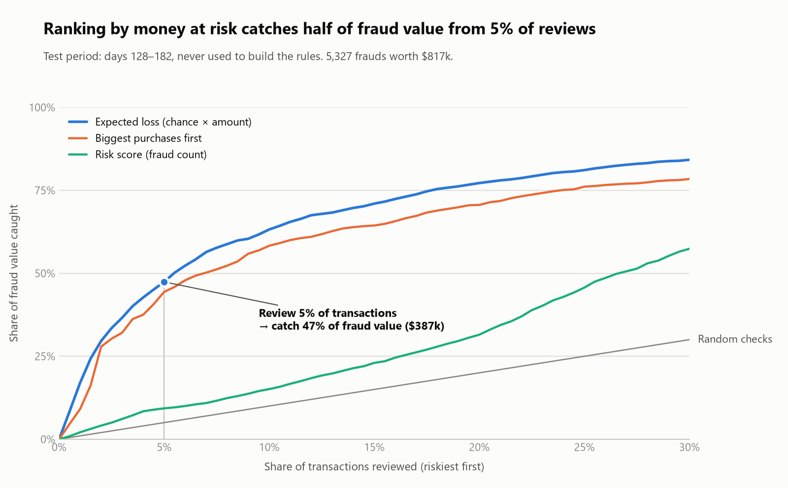
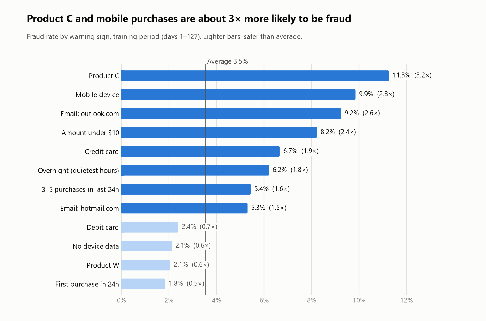
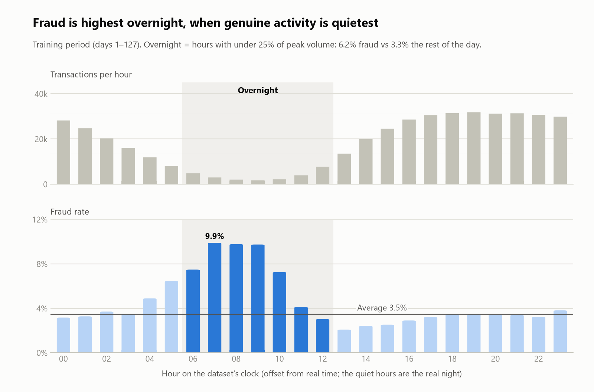

# Which transactions should a fraud team review first?

**Fraud risk analysis** of 590,540 real card-not-present transactions (IEEE-CIS / Vesta, 182 days).
**Tools:** Google BigQuery (SQL) · Python (charts)

<picture>
  <source media="(prefers-color-scheme: dark)" srcset="charts/01_value_capture_dark.png">
  
</picture>

## The recommendation

> **Rank the review queue by money at risk (chance of fraud × amount), not by chance of fraud alone.**
>
> - Reviewing the top **5%** of transactions catches **47% of fraud value** (~$387k of $817k) in a test period the rules never saw.
> - It finds **62% more frauds** than "review the biggest purchases" for the same effort (1 in 10 reviews hits fraud, vs 1 in 17).
> - **Add real-time velocity checks:** 63% of fraud comes *after* an account's first fraud, mostly within hours. Chargebacks take weeks, so blocking after confirmation is too late.

## The problem

Fraud teams can only check a small share of transactions by hand. The question is which ones, so that
limited reviewer time stops the most money being lost. Fraud is 3.5% of transactions here, so random
checks mostly land on genuine customers.

## Key findings

**1. Warning signs** (training period; average fraud rate 3.5%)

<picture>
  <source media="(prefers-color-scheme: dark)" srcset="charts/02_warning_signs_dark.png">
  
</picture>

**2. Fraud is highest overnight**, when genuine activity is quietest: 6.2% vs 3.3% the rest of the day.

<picture>
  <source media="(prefers-color-scheme: dark)" srcset="charts/03_overnight_dark.png">
  
</picture>

**3. Three ways to fill a 5% review queue** (test period)

| Method | Frauds caught | Fraud value caught | Hit rate |
|---|---|---|---|
| Risk score (chance of fraud) | **24.5%** | 9.3% | 17.0% |
| Biggest purchases first | 8.4% | 44.4% | 5.9% |
| **Expected loss (chance × amount)** | 13.6% | **47.4%** | 9.5% |

The risk score finds the most *cases*, but they're small: fraud it catches averages $58, fraud it misses $182.
Ranking by expected loss protects the most *money*.

## How I built it

1. **Reviewed and corrected a first draft.** I built a quick first version with an AI assistant, then checked every query against the data. It had treated `card1` as a unique card (one value covers ~709 accounts) and read an offset time column as clock time. I rebuilt both.
2. **Built an approximate account ID** (card + billing region + account start date) and **tested** it: 98.5% of multi-transaction accounts are all-fraud or all-genuine, vs 85% for the old grouping.
3. **Measured warning signs on the first 127 days only**, ignoring groups under 500 transactions, and excluding anything a real-time system couldn't know yet.
4. **Turned them into a points score**, then ranked by **expected loss** (score's fraud rate × amount).
5. **Tested on the last 55 days.** Train and test results match closely, so the rules generalise.

**Why these tools:** the analysis is joins, window functions and aggregations over 590k rows, which is SQL's job.
Python is used only to draw the charts, because the output is a written recommendation rather than a dashboard to explore.

## More detail

- [Technical notes](docs/technical_notes.md): data, corrections, method, full results, limitations, how to reproduce
- [SQL](sql/): seven steps, each commented
- [Results](results/): the summary tables behind every chart

---

**Rohan Pradhan** · Data Analyst · [Portfolio](https://rohanprad.github.io) · [LinkedIn](https://linkedin.com/in/rohanprad)

*Data: [IEEE-CIS Fraud Detection](https://www.kaggle.com/competitions/ieee-fraud-detection) (Vesta, via Kaggle), used for non-commercial portfolio purposes. Only summary results are published here.*
